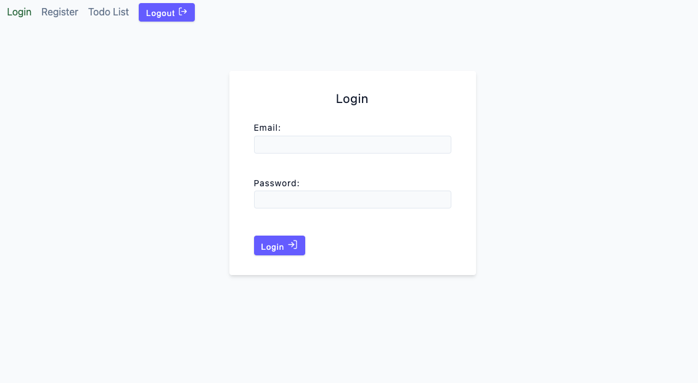
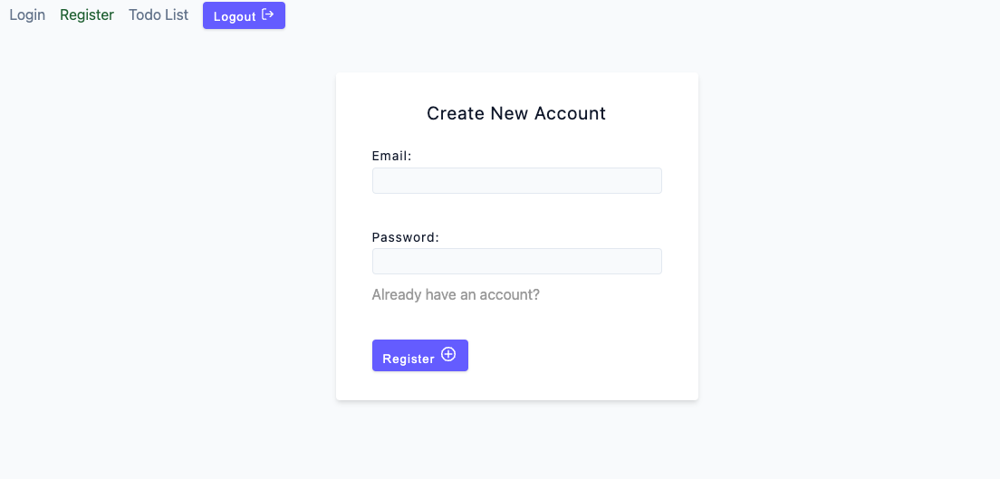
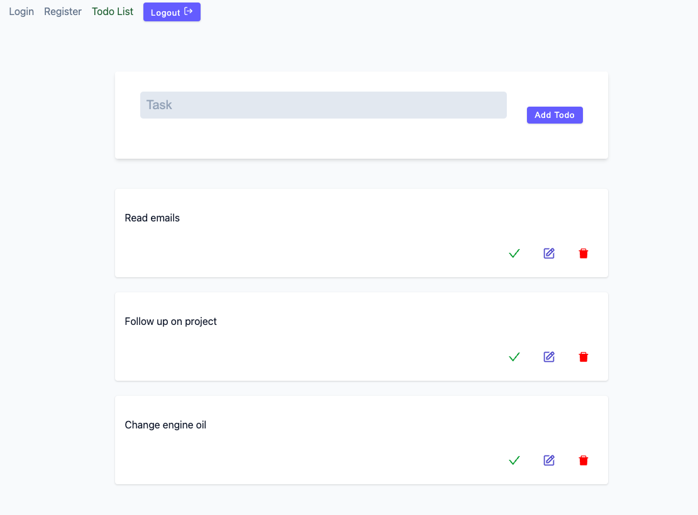
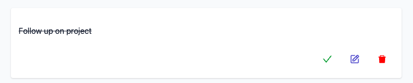
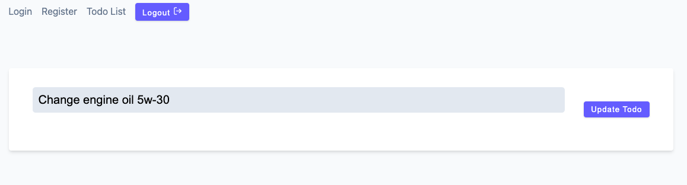

# Table of Contents

1. [Introduction](#introduction)
2. [Getting Started](#getting-started)
   - [Prerequisites](#prerequisites)
   - [Installation](#installation)
3. [Usage](#usage)
4. [Authentication](#authentication)
5. [Screenshots](#screenshots)
6. [Documentation](#documentation)

## Introduction

This is a Todo application built with the MERN stack (MongoDB, ExpressJS, ReactJS, and NodeJS). The application allows users to create, read, update, and delete their Todo tasks. In addition, the app also includes a login and register page for user authentication, using JSON web token (JWT) for secure user sessions.

# Website Link: [Click Here](https://todo-app-mern-stack.vercel.app/)

## Getting Started

This section includes instructions for setting up the project on a local machine.

### Prerequisites

- Node.js
- MongoDB
- npm

### Installation

1. Clone the repository: `git clone https://github.com/KevinThomasNY/MERN-todo-app.git`
2. Install the dependencies: `npm install`
3. Start the development server: `npm run start`
4. Start the frontend (client): `npm run start`
5. Create .env file in the root of the server folder. You need to add three variables.
   1. PORT: (recommended 3000)
   2. JWT_SECRET: is a secret key used for JSON Web Token
   3. MONGODB_URI is the URI for your MongoDB database

## Usage

1. Open `http://localhost:3000` in your browser
2. Register a new user by navigating to the "Register" page and filling out the registration form.
3. Login with your registered user credentials.
4. Create, view, update, and delete Todo tasks on the "Todo List" page.

## Authentication

The app uses JSON web token (JWT) for authentication, ensuring secure user sessions. Upon successful login, a JWT is generated and stored in the user's browser, allowing for protected routes and actions within the app.

## Screenshots

### Login

### Register

### Todo List

### Todo Marked Complete

### Editing a Todo

## Documentation

- [MongoDB](https://www.mongodb.com/)
- [ExpressJS](https://expressjs.com/)
- [ReactJS](https://reactjs.org/)
- [NodeJS](https://nodejs.org/)
- [JSON Web Token](https://jwt.io/)
